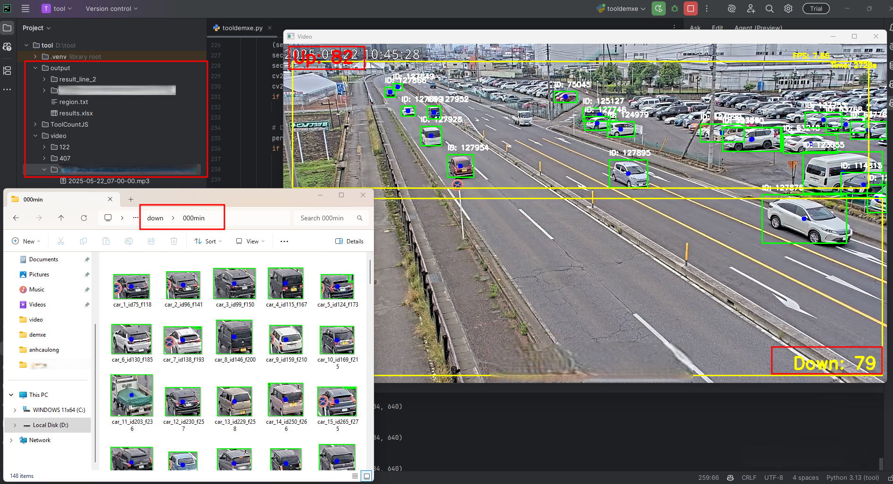

# Vehicle Counting with YOLOv8



This project is a Python tool for detecting and counting vehicles in video files using the YOLOv8 model (Ultralytics). It allows users to select two regions of interest (rectangles) in the video frame, then counts vehicles passing through these regions and saves the results.

## Features
- Select two custom regions in the video for vehicle counting.
- Detect and track vehicles using YOLOv8.
- Count vehicles passing through the defined regions.
- Save cropped images of detected vehicles by time period.
- Export counting results to an Excel file.

## Requirements
- Python 3.8+
- opencv-python
- pandas
- ultralytics
- CUDA Toolkit & cuDNN (for GPU acceleration, must be installed separately)

Install dependencies:
```
pip install -r requirements.txt
```

## Usage
1. Place your video files in the `video/` folder (supported: .mp4).
2. Run the script `tooldemxe.py`.
3. On first run, select two rectangles on the first video frame (for counting logic).
4. The tool will process all videos in the `video/` folder, count vehicles, and save results in the `output/` folder.

## Output
- Cropped images of detected vehicles by time period in `output/result_line_2/`.
- Counting results in Excel format: `output/results.xlsx`.

## Run on CPU or GPU

By default, the tool will use GPU if available. To force CPU or CPU usage, edit the following line in `tooldemxe.py`:

```
model.to("cuda")  # Use GPU (CUDA)
```
- To run with GPU (if your machine has CUDA): keep the line above unchanged.
- To run with CPU: change the line above to
```
model.to("cpu")  # Use CPU
```

**Note:**
- If running with GPU, you need to install the correct NVIDIA driver, CUDA Toolkit, and cuDNN.
- If running with CPU, processing will be slower but you do not need to install CUDA.

## Notes
- For best performance, ensure you have a compatible NVIDIA GPU and CUDA/cuDNN installed.
- The YOLOv8 model file (`yolov8m.pt`) should be present in the project directory.

---

This tool is suitable for traffic analysis, vehicle flow statistics, and similar applications.
